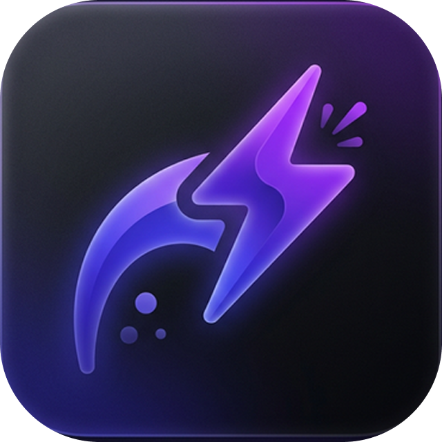

# Nudge - One tap. Back in the conversation.

Nudge is a powerful, lightweight Chrome extension designed to act as your personal CRM directly inside your browser. It helps you stay on top of your professional relationships by allowing you to save follow-ups from Gmail, LinkedIn, WhatsApp, and Outlook with a single tap.



## 🚀 Key Features

- **One-Tap Follow-ups**: Seamlessly integrate "Save as Task" buttons into your favorite communication platforms.
- **Multi-Platform Support**: Works where you work—Gmail, LinkedIn Messaging, WhatsApp Web, and Outlook.
- **Smart Reminders**: Never drop the ball again. Set exact dates and times for follow-ups and receive desktop notifications.
- **Privacy First**: Nudge is built with privacy at its core. It does **not** read or harvest the content of your conversations.
- **Zero Configuration**: Start saving tasks in minutes. No complex CRM setup required.
- **Clean Dashboard**: Manage all your pending follow-ups in a beautiful, CRM-style pipeline view.

## 🛠️ Technology Stack

- **Frontend**: HTML5, Vanilla JavaScript.
- **Styling**: Tailwind CSS for a modern, responsive design.
- **Icons**: Lucide Icons for a crisp, clean UI.
- **Typography**: Inter and Outfit Google Fonts for premium readability.
- **Infrastructure**: Vercel for lightning-fast deployment.

## 📂 Project Structure

- `index.html`: The main landing page, optimized for SEO and high conversion.
- `privacy-policy.html`: A detailed, transparent privacy policy.
- `vercel.json`: Configuration for Vercel deployment, including clean URLs.
- `package.json`: Node.js configuration for local development and serving.
- `logo.png` & icons: Branding assets for the landing page and extension.

## 🔧 Development

To run the landing page locally:

1. Clone the repository.
2. Install dependencies:
   ```bash
   npm install
   ```
3. Start the development server:
   ```bash
   npm run dev
   ```

## 🌐 Links

- **Chrome Web Store**: [Install Nudge](https://chromewebstore.google.com/detail/ndjmcmejbfehgknkcbkfongfdhobhidn?utm_source=item-share-cb)
- **Website**: [nudge.brilworks.com](https://nudge.brilworks.com)

---

Developed with ❤️ by [Brilworks](https://www.brilworks.com).
